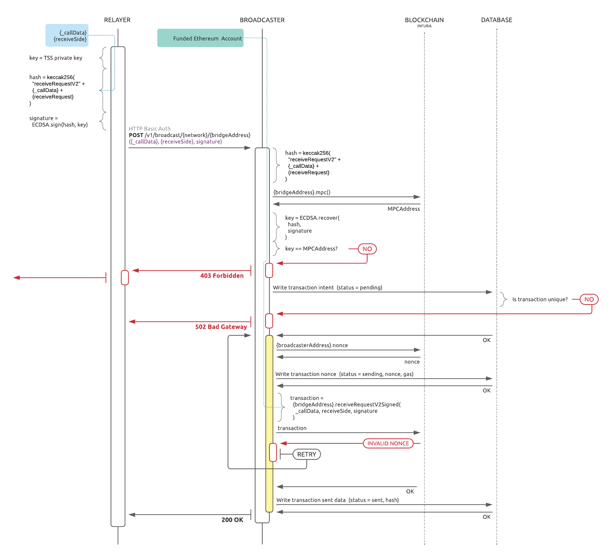

# Building

```
go install github.com/markbates/pkger/cmd/pkger # optional for dev
go generate                                     # optional for dev
go build ./cmd/broadcasterd
```

# Overall service design



Important notes:

* Currently, API works in blocking mode. Client will receive 200 OK only if
  transaction successfully sent to blockchain and written into DB.
* Service could be run both with transaction confirmation enabled and disabled.
  Enabling confirmation mode will significantly slow down API.
* After receiving interrupt signal service will not accept new HTTP connections,
  but will wait until all request inflight will be processed.
* After starting up service will go through all transactions in pending state
  (from DB) and will try to resend them.
* Service uses nonce directly retrieved from blockchain.


# API

Client bindings are located in the [client](client) directory.

## /v1/status

Replies with **200 OK**.

## /v1/broadcast/{network_id}/{bridge}

Validates given signature using ECDSA signature algorithm against remote MPC address.
If signature is valid, calls bridge's `receiveRequestV2Signed` with given arguments.

Auth: basic HTTP auth if `server.auth` is specified in the config.

URL Params:
* `{network}` — is network name from config file.
* `{bridge}` — is bridge address in hex form.

Request format: JSON object with the following fiels.

| field            | type        | description                                    |
| :---             | ---         | ---                                            |
| **call_data**    | base64      | `_callData` argument for smart contract call   |
| **receive_side** | hex address | `receiveSide` argument for smart contract call |
| **signature**    | base64      | `signature` argument for smart contract call   |

Returns:

* **200 OK** — if signature is valid and transaction is accepted.
* **400 Bad Request** — if incoming request is malformed.
* **422 Unprocessable Entity** — if incoming request is invalid or missing some fields. In details field of response will be stored addition information.
* **500 Internal Server Error** — if transaction could not be broadcasted.

# Configuring

See [config.yaml.example](config.yaml.example) for example of the config.

Service can be configured using both config file and env variables.  
**Note**: config file takes precedence over env variables **except** `BROADCASTER_NETWORK_KEY_%s`.  
**Note**: complex values should be specified in YAML/JSON format.

| var                                | type      | config var         | description                                                   |
|:-----------------------------------| ---       | ---                | ---                                                           |
| **BROADCASTER_NETWORKS**           | map       | `networks`         | specify whole networks section                                |
| **BROADCASTER_SERVER**             | obj       | `server`           | specify whole server section                                  |
| **BROADCASTER_SERVER_ADDRESS**     | host:port | `server.address`   | specify address to listen on                                  |
| **BROADCASTER_STORE_DSN**          | string    | `store.dsn`        | specify db connection string                                  |
| **BROADCASTER_RECOVERY**           | obj       | `recovery`         | specify whole recovery section                                |
| **BROADCASTER_CHAIN_%s_KEY**       | string    | `networks[%s].key` | specify private key for specific network `%s` (in upper case) |
| **BROADCASTER_CHAIN_%s_WHITELIST** | string    | `networks[%s].key` | specify private key for specific network `%s` (in upper case) |


# Running

```
go build ./cmd/...
./broadcasterd start --config config.yaml
```

# Testing

Run `broadcasterd` with example config:
```
go build ./cmd/...
./broadcasterd start --config config.yaml.example
```

Use test tool from `hack` directory to deploy mock test contract and to sign
test transaction.

Configure `broadcasterd` to use same private key for your test network.

```
go run hack/test.go \
    --network "wss://rinkeby.infura.io/ws/v3/b3572a473b864c489a470acf49d4b41b" \
    --private-key "bfe415cb5bff47d5d9eb45ffc9d06bf757287dd2c7c44b81debc434942e1d25c" \
    deploy-mock-contract

# balance 79127920826670360
# trx hash 0x91386796fab108710b438193f0308f6a3ef7753833417190a6ddfe6f8eaf5a3d
# contract address 0xea6D9C5DBfC16a91824d6C32ec343282bC13F10C
```

Sign one message and get request object. Use this JSON in curl or other tool of your choice.
Use generated request to call locally running `broadcasterd` to see the response.

```
go run hack/test.go \
    --private-key "bfe415cb5bff47d5d9eb45ffc9d06bf757287dd2c7c44b81debc434942e1d25c" \
    sign --call-data testing

# {
#  "call_data": "dGVzdGluZw==",
#  "receive_side": "0x32f1d8c86ba575eac312e5712e01d912b8234528",
#  "signature": "gCh/co3VQnoIog2dgF6F7EB+Od1P2tA64fJKA3dL1XFWTWniUXo6yf7CAeVMaNnjaPKOBHnTl23y5EfUUmO7fgE="
# }

```

Request service directly from test tool.

```
go run cmd\test-tool\main.go \
    --private-key "bfe415cb5bff47d5d9eb45ffc9d06bf757287dd2c7c44b81debc434942e1d25c" \
    request \
      \
    --endpoint http://localhost:4040/v1/broadcast/4/0xea6D9C5DBfC16a91824d6C32ec343282bC13F10C
```

Run load test (siege).

```
go run hack/test.go \
    --private-key "bfe415cb5bff47d5d9eb45ffc9d06bf757287dd2c7c44b81debc434942e1d25c" \
    siege \
    --endpoint http://localhost:4040/v1/broadcast/rinkeby/0x1185342F0B1EAd37B180D2C0785b22b7949EAed8 \
    --requests 100 \
    --concurrency 10
```

# Build Docker Image
```
docker build --build-arg VERSION=$(git describe --tags --long) -t svc-broadcaster:$(git describe --tags) .
```
